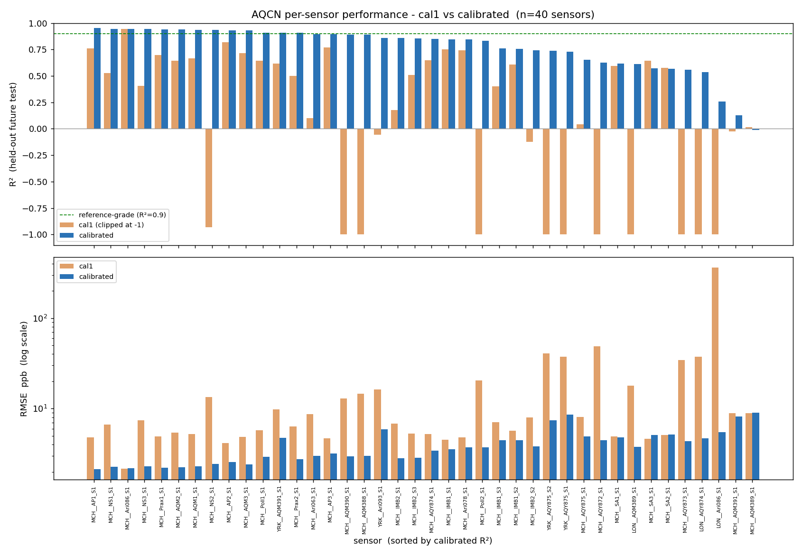

# AQCN: Adaptive Quality Calibration Network

**A self-managing calibration system that turns the noisy first-pass (cal1) output of low-cost air-quality sensors into near reference-grade data across a whole multi-city network, automatically, with no human intervention.**

Evaluated on the **QUANT** dataset (49 sensor instruments, 3 UK cities, 3 years). Every design choice in the pipeline is the proven winner of a documented head-to-head benchmark. Nothing is assumed.

---

## TL;DR: Headline Result

On strictly held-out future data, across all 40 usable sensors, the core system re-calibrates the sensors' cal1 readings to a **median RMSE of 3.6 ppb** and a **median R² of 0.85** (0.87 once FAULTY-flagged hours are dropped), with **37 / 40 sensors above R² 0.5 and 13 at near reference-grade (R² > 0.9)**, competitive with the best published per-sensor calibrations, while also handling drift, gaps, faults, and cold-start in one automatic loop.

A few sensors' cal1 product is badly behaved (one London unit emits spurious values as low as -20,000 ppb, giving a cal1 R² of -3287), which makes a plain *mean* over sensors misleading. So every figure below is given as **mean | median**, and the **median** is the honest "typical sensor" number.

| Metric (vs ratified reference) | cal1 baseline (mean \| median) | **AQCN (mean \| median)** | AQCN clean (median) |
|---|---|---|---|
| RMSE, typical error (ppb) | 20.67 \| 6.94 | **4.01 \| 3.65** | **3.36** |
| MAE, average error (ppb)  | 10.42 \| 6.16 | **2.86 \| 2.66** | **2.56** |
| R², variance explained      | -84.97 \| 0.45 | **0.76 \| 0.85** | **0.87** |
| Willmott d, index of agreement | 0.74 \| 0.83 | **0.94 \| 0.96** | **0.97** |
| Sensors with R² > 0.5 | 20 / 40 | **37 / 40** | n/a |

Per-sensor error reduction is **55 % (median)** / 81 % (mean, inflated by a few badly-behaved cal1 baselines). The full per-sensor picture (every sensor, cal1 vs calibrated) is plotted in [`results/per_sensor_performance.png`](results/per_sensor_performance.png):



> *"Clean" is the delivered stream with FAULTY-flagged sensor-hours excluded (§3, stage 4). The headline numbers come from the **core** adaptive system (calibration + drift + fault detection); the gap-fill / cold-start / GNN enhancements are benchmarked separately (§4) and are not folded into them.*

---

## 1. The Problem

Reference-grade air monitors cost tens of thousands of euros, so a city has only one or two. Low-cost sensors cost a few hundred euros and can be deployed by the dozen, but their readings are systematically wrong: they drift as they age, react to temperature and humidity, differ unit-to-unit, drop out, and occasionally fail. The challenge is to **correct them automatically, at network scale, and keep them correct over years**, without a human re-calibrating each device by hand.

This decomposes into seven coupled sub-problems: (1) environmental cross-sensitivity, (2) gas cross-interference, (3) long-term drift, (4) unit-to-unit variability, (5) missing data, (6) hardware faults, and (7) cold-starting brand-new sensors with no history.

## 2. The Dataset

**QUANT**: *A Three-Year, Multi-City Air Quality Dataset of Commercial Air Sensors and Reference Data for Performance Evaluation.*
DOI: [10.5281/zenodo.10775692](https://doi.org/10.5281/zenodo.10775692)

- 49 distinct sensor instruments from 14 manufacturers (the paper's main and wider-participation studies total 43 commercial devices), co-located with ratified reference monitors at **Manchester, London, and York** (UK), Dec 2019 to Oct 2022, hourly.
- This work studies **NO₂** at the manufacturers' first calibrated product, version `cal1`, re-calibrating it against the **Ratified** reference. (cal1 is already a manufacturer calibration, not raw voltage, so the baseline here is a real shipped product, which makes the comparison a harder and more honest one.)
- Predictors per hour: the sensor's own NO₂ / O₃ / NO / PM channels, plus co-located meteorology (temperature, humidity, pressure) and time-of-day/week encodings. The reference NO₂ is the prediction target.

**From the full dataset to 40 evaluated sensors.** The released sensor file holds 49 distinct instruments / 92 deployed sensor systems (instrument x unit x city) across all pollutants. We narrow to a controlled, supervised NO₂ study in three transparent steps (counts are sensor systems):

| Step | Filter | Sensor systems |
|---|---|---|
| 0 | Deployed sensor systems reporting **NO₂** (any version) | 55 |
| 1 | ... reporting NO₂ under the **`cal1`** product | 46 |
| 2 | ... with **≥ 1,000 paired (sensor, Ratified-reference) hours** to train *and* fairly test | **40** |

So the dataset spans 49 instruments / 92 systems; **40** is the NO₂ / `cal1` subset with enough paired ground truth to calibrate and evaluate fairly. Extending to other pollutants (O₃, PM) and calibration versions is straightforward future work.

## 3. Method: an evidence-built pipeline

The guiding principle: **never assume a method is best, benchmark it.** Each stage was selected by a head-to-head comparison on identical held-out data, then assembled into one pipeline.

```
 sensor cal1 reading + meteorology (per sensor, hourly, processed chronologically)
        |
        v
 [1] GAP FILLING: SAITS (attention-based imputation)
     fills short sensor dropouts so more hours are usable
        |
        v
 [2] COLD-START ROUTER
     new sensor (<14 days history) -> MAML meta-learned model
     established sensor            -> its own model
        |
        v
 [3] CALIBRATION: Random Forest  (Graph Neural Network in dense cities)
     f(sensor, co-gases, meteorology, time) -> true NO2  + confidence
        |
        v
 [4] FAULT DETECTION: ensemble on CALIBRATED same-city consensus
     flags SUSPECT / FAULTY; faulty readings excluded from clean output
        |
        v
 [5] DRIFT MONITOR: Kolmogorov-Smirnov distribution test (reference-free)
     on drift -> guarded automatic Random-Forest retraining
        |
        v
 OUTPUT: calibrated value, confidence, quality flag, sensor status
```

> **What actually runs in the headline evaluation.** Stages **[3] calibration, [4] fault detection, and [5] drift** form the *core* adaptive loop that produces the TL;DR numbers (`experiments/09`). Gap filling **[1]** is **disabled** there (`use_gap_fill=False`); SAITS is the benchmarked winner (§4), while the wired-in helper currently uses a lightweight Chronos stand-in. The cold-start router **[2]** (MAML) and the dense-city GNN are validated in their own experiments and reported alongside, not folded into the core numbers. Folding all five into a single always-on pipeline is the natural next integration step.

All evaluation uses a **strict temporal split** (train on the past, test on the genuine future) to prevent data leakage, a harder and more honest test than the random splits common in the literature. The split, and the train-only fitting of imputation statistics, are guarded by tests in [`tests/`](tests/).

## 4. Results: the benchmarks behind every choice

Each component was chosen by experiment (`experiments/01` to `08`); the final assembly is `experiments/09`.

**Calibrator, 9-model bake-off** (RMSE, held-out test; lower is better)

| Rank | Model | RMSE | R² |
|---|---|---|---|
| 1 | XGBoost | 5.016 | 0.579 |
| 2 | **Random Forest** (chosen) | 5.047 | 0.561 |
| 3 | Gradient Boosting | 5.062 | 0.559 |
| ... | SVR / k-NN | 5.2-5.4 | n/a |
| 8-9 | **CNN / MLP (deep nets)** | 8.2-8.4 | **< 0** |

Tree ensembles dominate; deep nets fail on limited per-sensor data. Random Forest is chosen for its accuracy **and** built-in uncertainty estimate (used downstream). XGBoost is a validated drop-in.

**Drift detection (5 detectors):** the KS-test ties CUSUM on accuracy but is **reference-free** and uses **31 % fewer recalibrations**, so it is chosen.

**Gap filling (4 imputers):** **SAITS** is best at every gap length (6 h: 3.63 vs linear 4.20), beating BRITS, CSDI, and linear interpolation.

**Cold start (5 strategies):** **MAML** meta-learning calibrates a brand-new sensor from 14 days of data at RMSE 6.77, **32 % better** than borrowing a neighbour's model.

**Fault detection (7 detectors x raw/calibrated):** running the consensus ensemble on **calibrated** signals (not raw) improves it **4-6x**; it is recall-oriented (catches 54-73 % of faults), which is what a monitoring system needs.

**Frontier check (Graph Neural Network):** in dense Manchester (33 sensors) a GNN beat Random Forest by **~10 %** (RMSE 3.39 vs 3.76), but degraded on tiny sub-networks, so it is deployed only where the network is dense.

Full numeric reports for every experiment are in [`results/`](results/).

## 5. How to Run

```bash
# 1. install
pip install -r requirements.txt

# 2. download QUANT into data/raw/ (~0.5 GB, once)
python download_data.py

# 3. run the full assembled system (end-to-end evaluation), then plot it
python experiments/09_final_system.py
python experiments/plot_final_system.py         # per-sensor raw-vs-calibrated figure

# 4. run the tests (leakage guards + metric + pipeline smoke; needs no data)
pytest -q

# (optional) reproduce any individual benchmark
python experiments/01_calibrator_bakeoff.py     # 9-model calibrator comparison
python experiments/03_drift_detectors.py        # CUSUM / ADWIN / BOCPD / KS / Uncertainty
python experiments/04_gap_imputers.py           # SAITS / BRITS / CSDI / linear
python experiments/05_cold_start.py             # MAML vs borrowing vs global
python experiments/08_graph_network.py          # GNN vs Random Forest
```

A CUDA GPU speeds up the deep-learning experiments (SAITS, CSDI, MAML, CNN, GNN) but is not required; everything runs on CPU.

## 6. Project Structure

```
aqcn/                         # library, one module per method
  data_loader.py              #   load + align QUANT (sensors, reference, meteorology)
  features.py                 #   build per-sensor feature matrices
  calibrator.py               #   Random Forest calibrator (+ confidence)
  maml_calibrator.py          #   MAML meta-learner (cold start)
  cold_start.py               #   calibration-transfer baseline
  drift_monitor.py            #   CUSUM drift detector
  adwin_monitor.py            #   ADWIN drift detector
  bocpd_monitor.py            #   Bayesian online change-point detector
  ks_monitor.py               #   Kolmogorov-Smirnov drift detector (chosen)
  uncertainty_monitor.py      #   model-uncertainty drift detector
  imputer_benchmark.py        #   SAITS / BRITS / CSDI gap-filling
  diffusion_imputer.py        #   windowing + CSDI helpers
  fault_ensemble.py           #   consensus + IQR + persistence fault detector
  fault_detectors.py          #   detector zoo for the fault bake-off
  fault_injection.py          #   synthetic-fault generator (for scoring)
  evaluator.py                #   metrics: RMSE, MAE, MBE, nRMSE, R2, r, Willmott d
  pipeline.py                 #   the assembled AQCN pipeline
experiments/                  # numbered, runnable studies (01-09)
  plot_final_system.py        #   per-sensor raw-vs-calibrated figure
tests/                        # leakage guards + metric + pipeline smoke tests
results/                      # benchmark reports (.txt) + per-sensor tables (.csv)
download_data.py              # fetch QUANT from Zenodo
```

## 7. Limitations & Future Work

- **Co-location.** In QUANT all sensors sit beside the reference, ideal for *learning* calibration but not for demonstrating *spatial* mapping. The natural next study deploys calibrated sensors physically across a city and re-validates, especially the Graph Neural Network, whose advantage partly relies on co-located peers seeing the same air.
- **Meteorology source.** Temperature, humidity, and pressure are taken from the co-located reference station. That is a legitimate external covariate (a real deployment pulls weather from a service), but the reference feed is perfectly co-located and quality-controlled, so a field deployment's noisier weather feed would be a slightly harder setting than reported here.
- **Fault detection is the open problem.** Even the best detector is recall-oriented with low precision, because real pollution spikes resemble faults and faults are rare. One of its three votes (residual vs reference) also needs the reference, so a fully reference-free deployment leans on the consensus and IQR votes alone. A human still reviews flags.
- **Sparse / hard sensors.** A handful of units calibrate poorly regardless (for example `MCH__AQM389` and `MCH__AQM391` stay below R² 0.15), visible as the low right-hand bars in the per-sensor figure. This is a data/hardware limitation (little signal, or a failing device), not a method one.

## 8. Key References

- Diez et al. (2024), *Long-term evaluation of commercial air quality sensors: the QUANT study*, AMT. [doi:10.5194/amt-17-3809-2024](https://doi.org/10.5194/amt-17-3809-2024)
- Du et al. (2022), *SAITS: Self-Attention-based Imputation for Time Series*. [arXiv:2202.08516](https://arxiv.org/abs/2202.08516)
- Finn et al. (2017), *Model-Agnostic Meta-Learning (MAML)*. [arXiv:1703.03400](https://arxiv.org/abs/1703.03400)
- Bifet & Gavalda (2007), *Learning from time-changing data with adaptive windowing (ADWIN)*.

## 9. Author

**Nasser Al-Qeifi**, M.Eng. Electrical and Computer Engineering
NasserAlQeifi@gmail.com · github.com/NasserAlqeifi

*Built as a research project: a fully benchmarked, self-managing calibration pipeline for low-cost air-quality sensor networks.*
